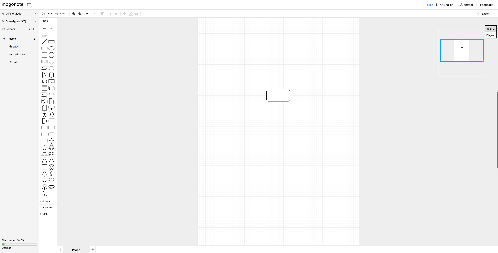
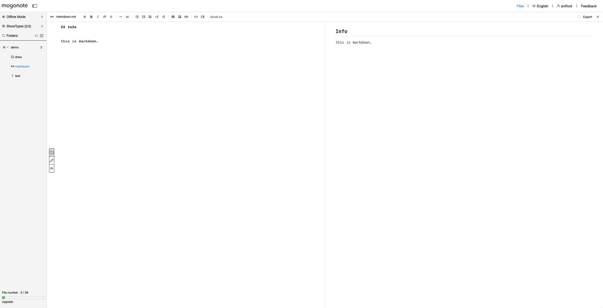
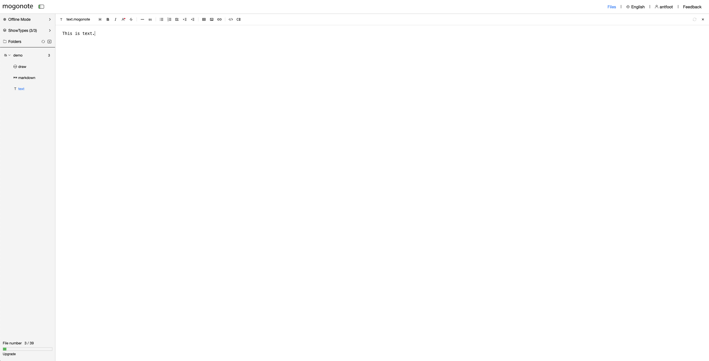

    

# En Doc

## mogonote

Structured knowledge management tool

## Website

https://mogonote.com/

## Features

+   Support Draw / Markdown / Text and more
+   Support browser storage and cloud storage
+   Support multi level directory

## More

We understand that you need a simple tool for knowledge management, which is why we made mogonote.

It is our original intention to upgrade mogonote and serve every user well.

Thank you for your continued support.

  

# 中文文档

## mogonote

知识结构化、体系化管理工具

## 在线网址

https://mogonote.com/

## 特点

+   **多类型支持:** 支持 流程图 / Markdown / Text 等类型的知识形式
+   **支持临时存储和永久存储:** 根据自身需要决定存储笔记到浏览器或者云端
+   **多级目录:** 没有复杂的概念，多级目录帮助您更好地管理知识

## 其他的话

我们理解您需要一个朴素的工具进行知识管理的需求，这也是我们做这个工具的原因。

打磨好产品，服务好每一位用户，更是我们的初心。

感谢您的持续支持。